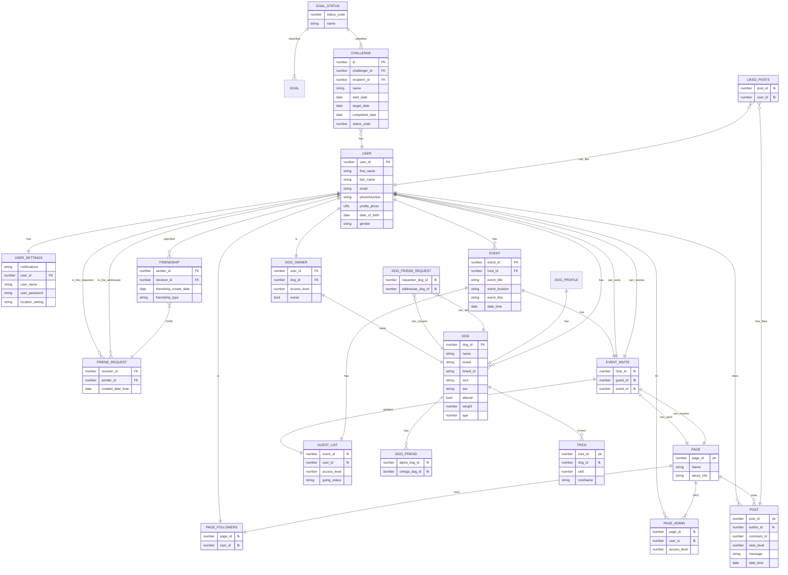

[Full Table View](https://mermaid.live/edit#pako:eNq1V91T4joU_1c6fVZHVBR5Y9aqHVngUtydueNMJrShzVia3ibousj_vidpCmmbqvtwfUA453e-P5Js3ZBFxB26DvyR4obiuMDrp0z-fAy8ufP-fnz8_q6-o8BbLPzJXeAMnQTzp6wBY1vndu57kxs09_559IIF4ChHIiGoIP9tCBes-LoIjqKCcE5Il0hw788AznMS0hUlvMQZvF3pestAwtKo7T0gZ6M7D91Ox-PpT28eSE_athVmdPPdn4AmPygBkmhXAqD7UQvVUKMQJeZuOhqjYDFaPAYVVJIAFKaYcyNQC_Lb_Wg89iZgpQ0_8HZsX9HuQno_vMlCc5U1mTs09iGBOk6FcAyIIiB_8sNfeGbbSGdwhjjJom6gys1XgIbGgoSEvpAvKf0UawQ4dDZ5hAUx46pFXYl2Zm82VWoiVunYl97GHPsP3g2S5KBRHOl5Sp9JJ07rAjcUbu_MzfQOTX9ODq0NBMCx14y32_4APrS8xFsapWLpUKRkOV4NAGoMnVZVelHWQy2EvxEwCmi4sJj73x4A85yxV8P-bD699cdePXxdrafMQGzl7538UJq2pYpss16SwhEFDZ8RjZz8uUaPWCypqzqVP9M0LSkcJLPYyfCaaO1G8eo2csaFRdmGk6IiKwVS1C7ZcA5vRMIKi8qQrdckkyI18gslryglLyStkWU_oZBtMmFVYnB0sGvY1jjWFZLzoz6QoPscPGXm-NSDSexpiGWXWOjgbiZq-fkfVR92w7Yb2VE7szBhCCkyU60zFzP4RFxgseHaZHsk6qb1_IAdey_uT0-T39Bc14jTPMEd2tiaxLilqX7SNXoTOuHzrj6cgn8t3ZlXrdausBoVnfiJmk-DgJdsAxXNVszIVrkbt1ZXbh9si6FBbRd-yVgqtzHRFyKwJdes3cbsoebjihbQt1nTdTjvLVSyxrTebLozarQ8YRmZKKv6eJiPnbxgK5oSBEzBmlPNVmhJC5HU-xhObiOi6pzZ3xt1eOaCZALuKCEWlFUn0wdJNgQV6xBtk5PD5eeVFVGLm7LSGNwyhABCzVm1QrYtN_ZjPnto8ardYnGxFBNUpKSDVznTwY4oDw-s5kY1_LYuitqyUGdnK5fVuaXK1mQqe2FB4F-EPrIr79rbLyr9xCFlc1VQkOUJzVFpXllv5ciAibfc4NdchPlt-6andNaumbWjlgUh7U7i9HcbysmvA00NOU5hSZvi2odXQuNE7N01t0V80FuLxbjxW_KtTg8kX3MfRLVrPAbaeuxtHiY4TUkWf1RRmlM9J7efJVbVGTwuRKO2igH0mFg5cPnIU1I15Oc52LlH7poUsAMjeOKqYJ9ceFyCL-4Qvi7TDXyDVQ84uDax4C0L3eEKp5wcueUjQL-IG1QvovCYdYei2AAtx5k73Lq_3OHxef_05Pz6_HxwNbjs9U-ve0fuG5DPrvon572r04vB9eV173pw1t8dub8ZA729k_7pWf-s1-tfXAwuzwanV0cuUeq_ly9z9UBXRv5VAtLm7g9noPel)

