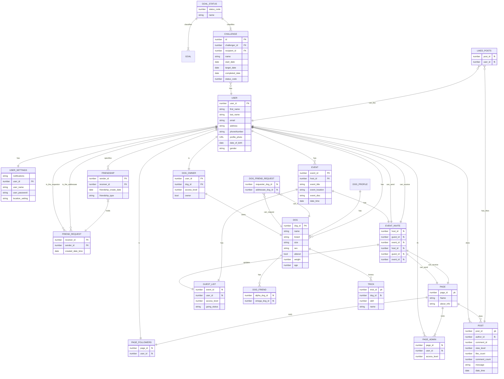

```mermaid
    erDiagram
    USER ||--|| USER_SETTINGS : has

    USER ||--o{ FRIEND_REQUEST : is_the_requestor
    USER ||--o{ FRIEND_REQUEST : is_the_addressee
    USER ||--o{ FRIENDSHIP : specifies
    FRIENDSHIP }|--|| FRIEND_REQUEST : holds

    USER ||--|| PAGE_FOLLOWERS: is
    USER ||--o{ PAGE_ADMIN : IS
    PAGE ||--|| PAGE_FOLLOWERS : HAS
    PAGE ||--|{ PAGE_ADMIN : HAS

    GOAL_STATUS ||--|{ GOAL : classifies
    GOAL_STATUS ||--|{ CHALLENGE : classifies
    CHALLENGE }o--|| USER : has

    USER ||--o{ EVENT: has
    GUEST_LIST ||--|| EVENT : has
    EVENT_INVITE ||--|| USER : can_send
    EVENT_INVITE ||--|| PAGE : can_send
    EVENT_INVITE ||--|| USER : can_receive
    EVENT_INVITE ||--|| PAGE : can_receive
    EVENT_INVITE ||--|| GUEST_LIST : updates
    EVENT ||--|| EVENT_INVITE : has

    USER ||--o{ POST : does
    PAGE ||--o{ POST : does
    LIKED_POSTS }o--|| USER : can_like
    LIKED_POSTS }o--|| POST : has_likes

    DOG_OWNER ||--|| DOG : owns
    USER ||--|| DOG_OWNER : is
    DOG }o--|| USER : has
    DOG ||--o{ DOG_FRIEND : has
    DOG_FRIEND_REQUEST }o--|| DOG : can_request
    DOG_FRIEND_REQUEST }o--|| DOG : can_receive
    DOG ||--o{ TRICK : knows
    DOG_PROFILE ||--|| DOG : has


DOG_PROFILE{

}

TRICK{
    number trick_id pk
    number dog_id fk
    number skill
    string name
}

LIKED_POSTS{
    number post_id fk
    number user_id fk
}

POST{
    number post_id pk
    number author_id fk
    number comment_id
    number view_level
    number like_count
    number comment_count
    string message
    date date_time
}


EVENT_INVITE{
    number host_id fk
    number guest_id fk
    number event_id fk
}

EVENT_INVITE{
    number host_id fk
    number guest_id fk
    number event_id fk
}

GUEST_LIST{
    number event_id fk
    number user_id fk
    number access_level
    string going_status
}

DOG_FRIEND_REQUEST{
    number requester_dog_id fk
    number addressee_dog_id fk
}

DOG_FRIEND{
    number alpha_dog_id fk
    number omega_dog_id fk
}

PAGE_FOLLOWERS{
    number page_id fk
    number user_id fk
}
PAGE_ADMIN{
    number page_id fk
    number user_id fk
    number access_level
}
PAGE{
    number page_id pk
    string Name
    string about_info
}

DOG_OWNER {
    number user_id FK
    number dog_id FK
    number access_level
    bool owner
    }
USER{
    number user_id PK
    string first_name
    string last_name
    string email
    string address
    string phoneNumber
    URL profile_photo
    date date_of_birth
    string gender
    }
    USER_SETTINGS{
        string notifications
        number user_id FK
        string user_name
        string user_password
        string location_setting
    }
    EVENT{
        number event_id PK
        number host_id FK
        string event_title
        string event_location
        string event_disc
        date date_time
    }
    FRIEND_REQUEST{
        number receiver_id FK
        number sender_id FK
        date created_date_time
    }
    FRIENDSHIP{
        number sender_id FK
        number receiver_id FK
        date friendship_create_date
        string friendship_type
        
    }
    DOG{
        number dog_id PK
        string name
        string breed
        string size
        string sex
        bool altered
        number weight   
        number age
       
    }
    GOAL_STATUS{
        number status_code
        string name
    }
    CHALLENGE{
        number id PK
        number challenger_id FK
        number recipient_id FK
        string name
        date start_date
        date target_date
        date completed_date
        number status_code
    }
```
